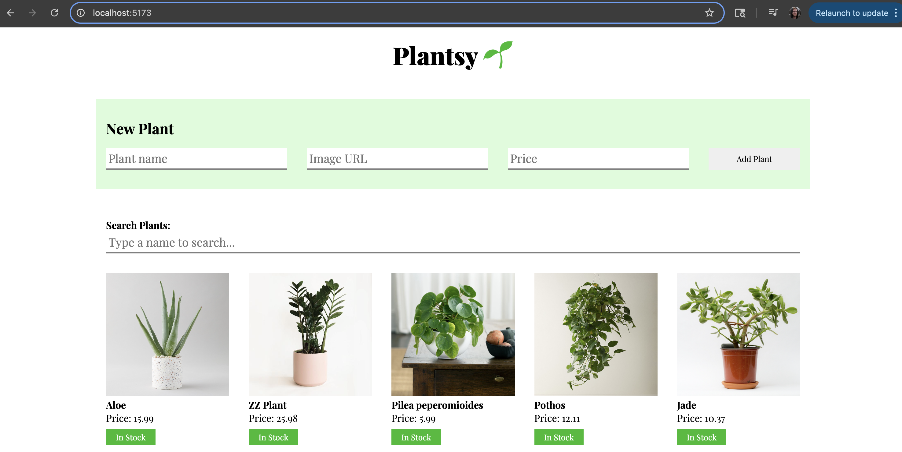

# Phase 2 Code Challenge: Plantsy

This is a React-based plant shop application that allows users to browse, search, add, and manage plants in an interactive and user-friendly interface.

# Features include:
- Browse Plants: View a list of available plants with details like name, price, and image.
- Search Functionality: Filter plants by name using a dynamic search bar.
- Add New Plants: Submit a form to add new plants to the inventory.
- Toggle Availability: Mark plants as "In Stock" or "Out of Stock" with a click of a button.

# Installation:
Upon cloning the respository, install dependencies via:
  npm install
Start the development server by running:
  npm start
Open your browser to see the app and enter the URL:
  http://localhost:5173/
Backend Server: this app requires the backend server to be running at http://localhost:6001 to fetch and save plant data.

# Screenshot:



-----

## Demo

Use this gif as an example of how the app should work.


## Instructions

Welcome to Plantsy! You've been tasked with building out some features for the
admin side of a plant store. The designers have put together the components and
CSS. Now it's up to you to bring the features to life by adding stateful logic
as well as persisting data to the backend via our API.

Your job will be to make our app work according to the user stories you will
find the [Deliverables](#Deliverables) section.

## Setup

1. Run `npm install` in your terminal.
2. Run `npm run server`. This will run your backend on port `6001`.
3. In a new terminal, run `npm run dev`.

Make sure to open [http://localhost:6001/plants](http://localhost:6001/plants)
in the browser to verify that your backend is working before you proceed!

## Endpoints

The base URL for your backend is: `http://localhost:6001`

## Deliverables

As a user:

1. When the app starts, I can see all plants.
2. I can add a new plant to the page by submitting the form.
3. I can mark a plant as "sold out".
4. I can search for plants by their name and see a filtered list of plants.

### Endpoints for Core Deliverables

#### GET /plants

Example Response:

```json
[
  {
    "id": 1,
    "name": "Aloe",
    "image": "./images/aloe.jpg",
    "price": 15.99
  },
  {
    "id": 2,
    "name": "ZZ Plant",
    "image": "./images/zz-plant.jpg",
    "price": 25.98
  }
]
```

#### POST `/plants`

Required Headers:

```js
{
  "Content-Type": "application/json"
}
```

Request Object:

```json
{
  "name": "string",
  "image": "string",
  "price": number
}
```

Example Response:

```json
{
  "id": 1,
  "name": "Aloe",
  "image": "./images/aloe.jpg",
  "price": 15.99
}
```
